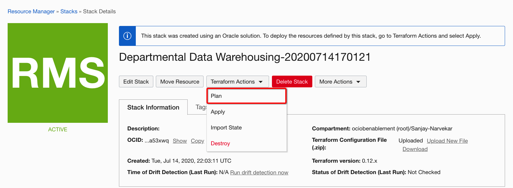
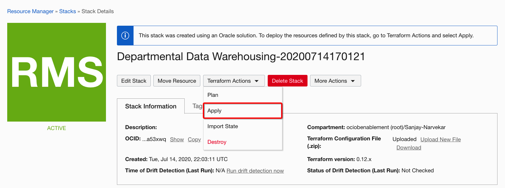
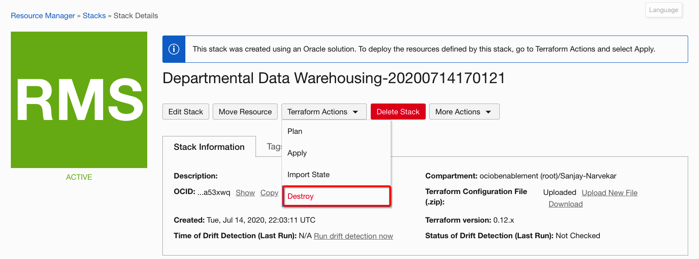

# adw-oac

This architecture uses Oracle Autonomous Data Warehouse to load and optimize data from multiple flat-file sources into a centralized data warehouse and then uses Oracle Analytics Cloud to analyze the data to provide actionable insights.
Oracle Resource Manager can be used to deploy Oracle Autonomous Data Warehouse and Oracle Analytics Cloud that are the components in this reference architecture

## Prerequisites

- You need a user with an Administrator privileges to execute the Oracle Resource Manager stack.
- Make sure your tenancy has service limits availabilities for Oracle Autonomous Data Warehouse and Oracle Analytics Cloud.

## Using Oracle Resource Manager (ORM)

1. From OCI **Console/Resource Manager**, create a new stack.
1. Select the "Departmental Data Warehousing" solution from the Sample Solutions screen
1. Select the Compartment for deploying this stack and Click Next
1. Set the required variables values in the Autonomous Data Warehouse Configuration and Oracle Analytics Cloud Configuration sections
1. Click Next
1. Click Create.
   
1. From the stack details page, Select **Plan** under **Terraform Actions** menu button and make sure it completes successfully.
    
1. From the stack details page, Select **Apply** under **Terraform Actions** menu button and make sure it completes successfully.
    
1. To destroy all created artifacts, from the stack details page, Select **Destroy** under **Terraform Actions** menu button and make sure it completes successfully.
    

