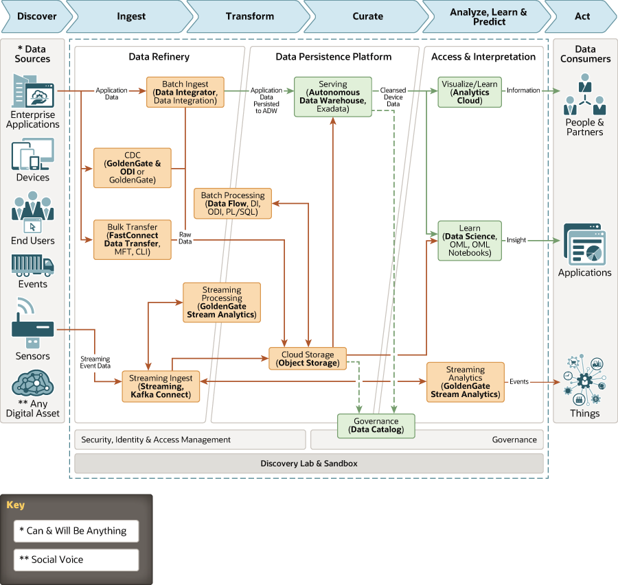

# adw-odi-data-lake

This architecture uses Oracle Data Integrator to load and optimize data from multiple into a centralized data warehouse (Oracle Autonomous Data Warehouse). Oracle Streams is used for ingesting continuous, high-volume streams of data into object storage.
Data Science is used to build, train, and manage machine learning (ML) models in Oracle Cloud Infrastructure. 
Data Flow is used to run your Apache Spark applications.
Oracle Analytics Cloud is used to analyze the data to provide actionable insights.

The Oracle Data Integrator Component of this architecture needs to be launched using the Oracle Data Integrator marketplace image (https://cloudmarketplace.oracle.com/marketplace/en_US/listing/62627436)

The Oracle GoldenGate Stream Analytics Component of this architecture needs to be launched using the Oracle GoldenGate Stream Analytics marketplace image (https://cloudmarketplace.oracle.com/marketplace/en_US/listing/70961838)

The Oracle GoldenGate Component of this architecture needs to be launched using the Oracle GoldenGate marketplace image (https://cloudmarketplace.oracle.com/marketplace/en_US/listing/58489224)

## Terraform Provider for Oracle Cloud Infrastructure
The OCI Terraform Provider is now available for automatic download through the Terraform Provider Registry. 
For more information on how to get started view the [documentation](https://www.terraform.io/docs/providers/oci/index.html) 
and [setup guide](https://www.terraform.io/docs/providers/oci/guides/version-3-upgrade.html).

* [Documentation](https://www.terraform.io/docs/providers/oci/index.html)
* [OCI forums](https://cloudcustomerconnect.oracle.com/resources/9c8fa8f96f/summary)
* [Github issues](https://github.com/terraform-providers/terraform-provider-oci/issues)
* [Troubleshooting](https://www.terraform.io/docs/providers/oci/guides/guides/troubleshooting.html)

## Clone the Module
Now, you'll want a local copy of this repo. You can make that with the commands:

    git clone https://github.com/oracle-quickstart/oci-arch-adw-oac
    cd adw-odi-data-lake
    ls

## Prerequisites
First off, you'll need to do some pre-deploy setup.  That's all detailed [here](https://github.com/cloud-partners/oci-prerequisites).

Secondly, create a `terraform.tfvars` file and populate with the following information:

```
# Authentication
tenancy_ocid         = "<tenancy_ocid>"
user_ocid            = "<user_ocid>"
fingerprint          = "<finger_print>"
private_key_path     = "<pem_private_key_path>"

# SSH Keys
ssh_public_key  = "<public_ssh_key_path>"

# Region
region = "<oci_region>"

# Compartment
compartment_ocid = "<compartment_ocid>"

# Object Storage
bucket_namespace = "<enter_tenancy_name_here>"

# Autonomous Data Warehouse
autonomous_database_admin_password="enter-password-here"

# Oracle Analytics Cloud
analytics_instance_capacity_capacity_type="enter_capacity_type_here"
analytics_instance_capacity_capacity_value="enter_capacity_value_here"
analytics_instance_feature_set="enter_feature_set_here"
analytics_instance_license_type="enter_license_type_here"
analytics_instance_name="enter_OAC_instance_name_here"
analytics_instance_idcs_access_token="insert_user_IDCS_token_here"

````

Deploy:

    terraform init
    terraform plan
    terraform apply

## Destroy the Deployment
When you no longer need the deployment, you can run this command to destroy it:

    terraform destroy


## Architecture Diagram




## Reference Archirecture

- [Enterprise data warehousing - an integrated data lake example](https://docs.oracle.com/en/solutions/oci-curated-analysis/index.html)
