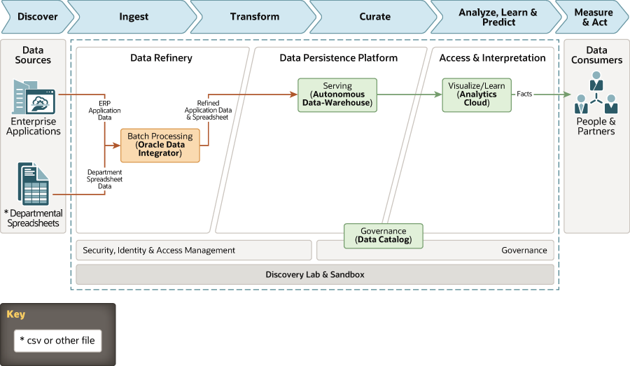

# adw-odi-oac

This architecture uses Oracle Autonomous Data Warehouse to load and optimize data from multiple flat-file sources into a centralized data warehouse and then uses Oracle Analytics Cloud to analyze the data to provide actionable insights.

The Oracle Data Integrator Component of this architecture has been build with the usage of Terraform remote modules (http://github.com/lfeldman/oci-oracle-data-integrator/modules/)

For details of the architecture, see [_Departmental data warehousing - an EBS integration example_](https://docs.oracle.com/en/solutions/oci-ebs-analysis/index.html)

## Prerequisites

- Permission to `manage` the following types of resources in your Oracle Cloud Infrastructure tenancy: `vcns`, `internet-gateways`, `route-tables`, `network-security-groups`, `subnets`, `autonomous-database-family`, and `instances`.

- Quota to create the following resources: 1 VCN, 2 subnets, 1 Internet Gateway, 1 NAT Gateway, 2 route rules, 1 ATP database instance, and 1 compute instance.

If you don't have the required permissions and quota, contact your tenancy administrator. See [Policy Reference](https://docs.cloud.oracle.com/en-us/iaas/Content/Identity/Reference/policyreference.htm), [Service Limits](https://docs.cloud.oracle.com/en-us/iaas/Content/General/Concepts/servicelimits.htm), [Compartment Quotas](https://docs.cloud.oracle.com/iaas/Content/General/Concepts/resourcequotas.htm).

## Deploy Using Oracle Resource Manager

1. Click [](https://console.us-phoenix-1.oraclecloud.com/resourcemanager/stacks/create?region=home&zipUrl=https://github.com/oracle-quickstart/oci-arch-adw-oac/raw/master/adw-odi-oac/resource-manager/oci-arch-adw-odi-oac.zip)

    If you aren't already signed in, when prompted, enter the tenancy and user credentials.

2. Review and accept the terms and conditions.

3. Select the region where you want to deploy the stack.

4. Follow the on-screen prompts and instructions to create the stack.

5. After creating the stack, click **Terraform Actions**, and select **Plan**.

6. Wait for the job to be completed, and review the plan.

    To make any changes, return to the Stack Details page, click **Edit Stack**, and make the required changes. Then, run the **Plan** action again.

7. If no further changes are necessary, return to the Stack Details page, click **Terraform Actions**, and select **Apply**. 

## Deploy Using the Terraform CLI

### Clone the Module
Now, you'll want a local copy of this repo. You can make that with the commands:

    git clone https://github.com/oracle-quickstart/oci-arch-adw-oac
    cd oci-arch-adw-oac/adw-odi-oac
    ls

### Set Up and Configure Terraform

1. Complete the prerequisites described [here](https://github.com/cloud-partners/oci-prerequisites).

2. Create a `terraform.tfvars` file, and specify the following variables:

```
# Authentication
tenancy_ocid         = "<tenancy_ocid>"
user_ocid            = "<user_ocid>"
fingerprint          = "<finger_print>"
private_key_path     = "<pem_private_key_path>"

# Region
region = "<oci_region>"

# Compartment
compartment_ocid = "<compartment_ocid>"

# Autonomous Data Warehouse
autonomous_database_admin_password="<enter-password-here>"

# Oracle Analytics Cloud
analytics_instance_capacity_capacity_type="<enter_capacity_type_here>"
analytics_instance_capacity_capacity_value="<enter_capacity_value_here>"
analytics_instance_feature_set="<enter_feature_set_here>"
analytics_instance_license_type="<enter_license_type_here>"
analytics_instance_name="<enter_OAC_instance_name_here<"
analytics_instance_idcs_access_token="<insert_user_IDCS_token_here>"

````

### Create the Resources
Run the following commands:

    terraform init
    terraform plan
    terraform apply

### Destroy the Deployment
When you no longer need the deployment, you can run this command to destroy the resources:

    terraform destroy

## Architecture Diagram



