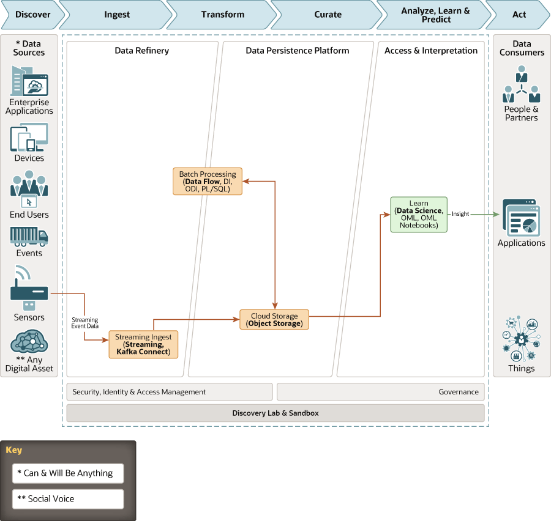

# odi-data-science

This architecture uses Oracle Data Integrator or Data Integration Service to load and optimize data from multiple into an object storage bucket. Oracle Streams is used for ingesting continuous, high-volume streams of data into object storage.
Data Science is used to build, train, and manage machine learning (ML) models in Oracle Cloud Infrastructure. 
Data Flow is used to run your Apache Spark applications.

The Oracle Data Integrator Component of this architecture needs to be launched using the Oracle Data Integrator marketplace image (https://cloudmarketplace.oracle.com/marketplace/en_US/listing/62627436)

## Deploy Using Oracle Resource Manager

1. Click [](https://cloud.oracle.com/resourcemanager/stacks/create?zipUrl=https://github.com/Carl-Lejerskar/odi-datascience/archive/0.0.2.zip)

    If you aren't already signed in, when prompted, enter the tenancy and user credentials.

1. Review and accept the terms and conditions.

2. Select the region where you want to deploy the stack.

3. Follow the on-screen prompts and instructions to create the stack.

4. After creating the stack, click **Terraform Actions**, and select **Plan**.

5. Wait for the job to be completed, and review the plan.

    To make any changes, return to the Stack Details page, click **Edit Stack**, and make the required changes. Then, run the **Plan** action again.

6. If no further changes are necessary, return to the Stack Details page, click **Terraform Actions**, and select **Apply**. 


## Terraform Provider for Oracle Cloud Infrastructure
The OCI Terraform Provider is now available for automatic download through the Terraform Provider Registry. 
For more information on how to get started view the [documentation](https://www.terraform.io/docs/providers/oci/index.html) 
and [setup guide](https://www.terraform.io/docs/providers/oci/guides/version-3-upgrade.html).

* [Documentation](https://www.terraform.io/docs/providers/oci/index.html)
* [OCI forums](https://cloudcustomerconnect.oracle.com/resources/9c8fa8f96f/summary)
* [Github issues](https://github.com/terraform-providers/terraform-provider-oci/issues)
* [Troubleshooting](https://www.terraform.io/docs/providers/oci/guides/guides/troubleshooting.html)

## Clone the Module
Now, you'll want a local copy of this repo. You can make that with the commands:

    git clone https://github.com/oracle-quickstart/oci-arch-adw-oac
    cd oci-arch-adw-oac/odi-data-science
    ls

## Prerequisites
First off, you'll need to do some pre-deploy setup.  That's all detailed [here](https://github.com/cloud-partners/oci-prerequisites).
Also ensure that you have followed the steps in the documentation [here] (https://docs.cloud.oracle.com/iaas/data-integration/using/preparing-for-connectivity.htm) to ensure that you are able to launch a Data Integration workspace.


Secondly, create a `terraform.tfvars` file and populate with the following information:

```
# Authentication
tenancy_ocid         = "<tenancy_ocid>"
user_ocid            = "<user_ocid>"
fingerprint          = "<finger_print>"
private_key_path     = "<pem_private_key_path>"

# SSH Keys
ssh_public_key  = "<public_ssh_key_path>"

# Region
region = "<oci_region>"

# Compartment
compartment_ocid = "<compartment_ocid>"

# Object Storage
bucket_namespace = "<enter_tenancy_name_here>"


````

Deploy:

    terraform init
    terraform plan
    terraform apply

## Destroy the Deployment
When you no longer need the deployment, you can run this command to destroy it:

    terraform destroy


## Architecture Diagram




## Reference Archirecture

- [Enterprise data warehousing - a predictive maintenance example](https://docs.oracle.com/en/solutions/oci-streaming-analysis/index.html)
